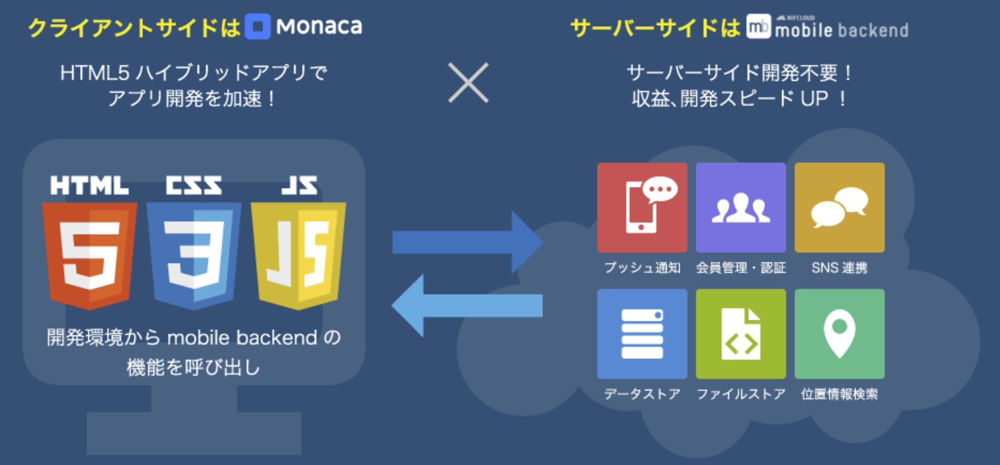
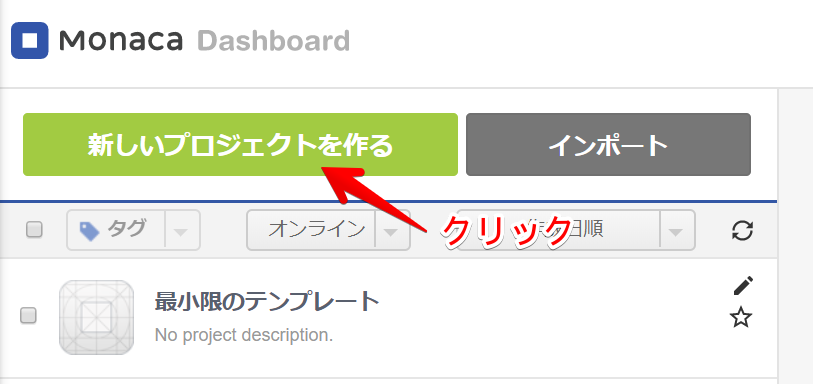
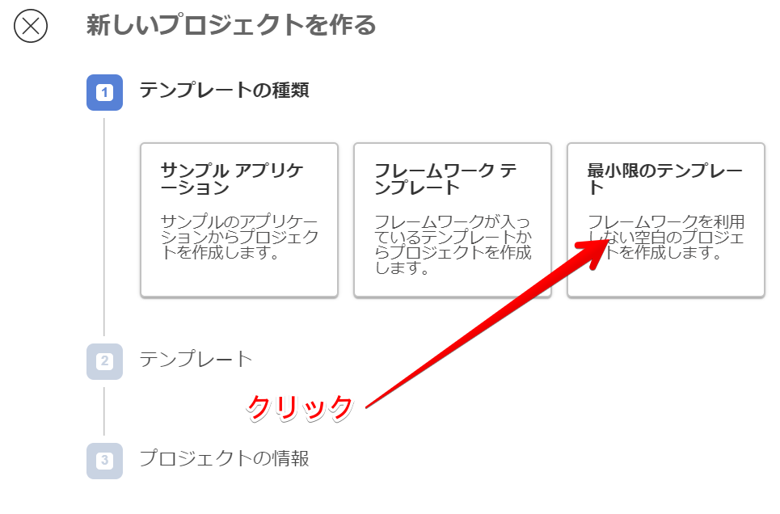
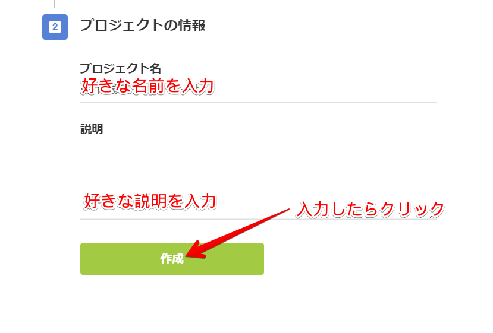
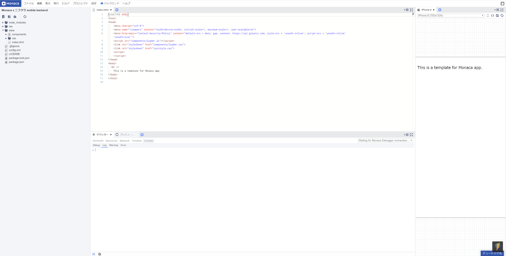
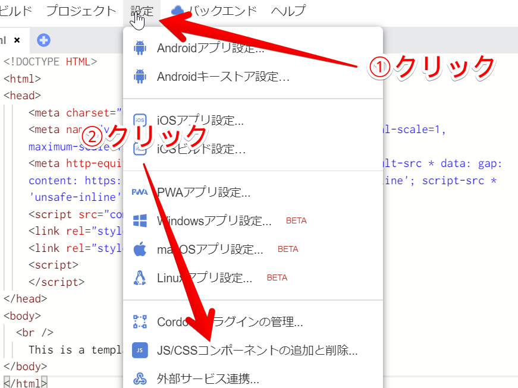
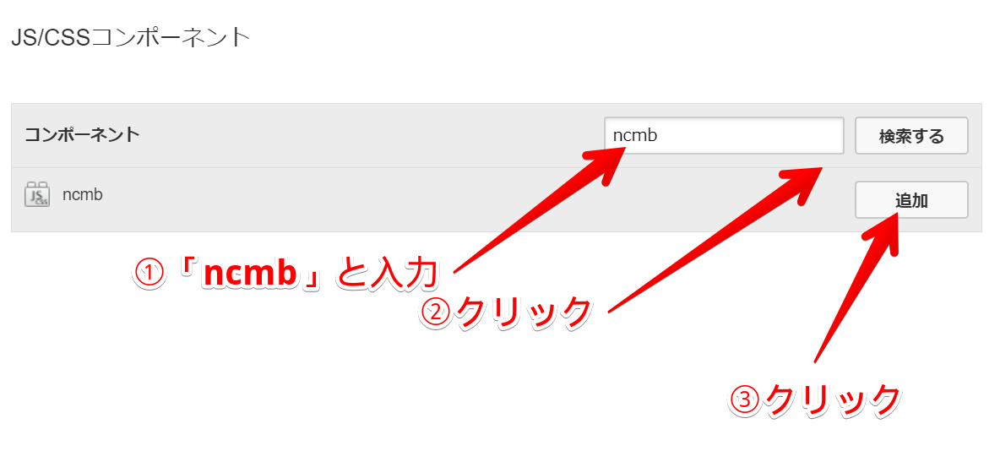
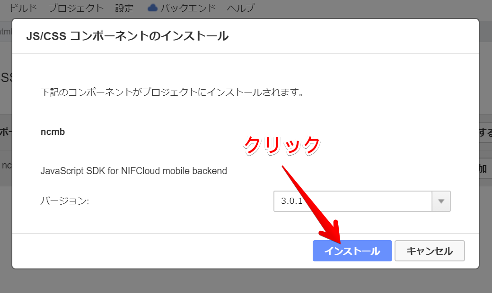
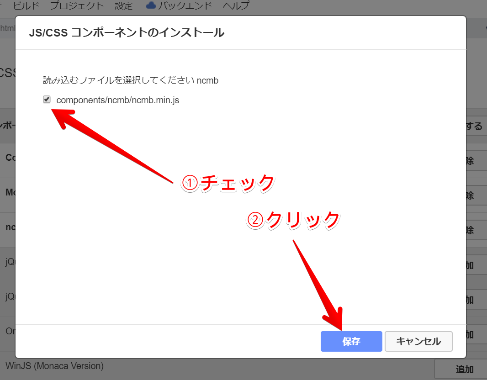

title: Monaca × ニフクラ mobile backendでクラウド連携アプリ開発ハンズオン！
title_row1: Monaca × ニフクラ mobile backendで
title_row2: クラウド連携アプリ開発ハンズオン！
company_ja: 富士通クラウドテクノロジーズ株式会社
company_en: FUJITSU CLOUD TECHNOLOGIES LIMITED
thisyear: 2019
class: animation-fade
layout: true

<!-- This slide will serve as the base layout for all your slides -->
.bottom-bar[
  .small[
  .center[Copyright 2017 - {{thisyear}} FUJITSU CLOUD TECHNOLOGIES LIMITED]
  ]
]

---

class: impact

# {{title_row1}}
# {{title_row2}}

.footer[
    {{company_ja}}
]

---

class: impact

## はじめに

---

# 前段

## 本日の資料

本日の資料(この資料)はここにあります。  
※ソースコードをコピペする際などに利用します  
.big[__https://hgoehoge__]

--

## 事前準備

以下のものを事前に用意しておいてください。
- Google Chrome最新版
- Monacaアカウント
- ニフクラ mobile backendアカウント

---

# 自己紹介

.col-6[
  ## 佐々木大樹
  ### 所属
  富士通クラウドテクノロジーズ株式会社
  ### 業務
  ニフクラ mobile backend 企画
]

.col-6[
  
]

---

# ニフクラ mobile backendとは


---

# ニフクラ mobile backend × Monaca

.center[]

---

class: impact

## 準備

---

# ニフクラ mobile backendの準備

## アプリの作成

---

# 

---

# Monacaの準備

## プロジェクトの作成

Monacaダッシュボード(要ログイン)から、以下の手順でプロジェクトを作成します。

.col-4[
  
]
.col-4[
  
]
.col-4[
  
]

作成されたら、作成したプロジェクトをクリックして「クラウドIDEで開く」を押してください。

---

#  Monacaの準備

この画面が表示されます。  
これで準備は完了です。

.center[]

---

class: impact

## Monaca × ニフクラ mobile backendの連携

---

# Monacaとmobile backendの連携

## SDKの導入①

以下手順でmobile backendのJavaScript SDKの導入します。

.center[
  .col-6[
    
  ]
  .col-6[
    
  ]
]

---

# Monacaとmobile backendの連携

## SDKの導入②

以下手順でmobile backendのJavaScript SDKの導入します。

.center[
  .col-6[
    
  ]
  .col-6[
    
  ]
]

---

# まとめ

--

## hoge

--

## fuga

--

.center[
  .big[ありがとうございました！]
]
---

# There's more

## Syntax highlighting

You can also add `code` to your slides:
```html
<div class="impact">Some HTML code</div>
```

## CSS classes

You can use .alt[shortcut] syntax to apply .big[some style!]

...or just <span class="alt">HTML</span> if you prefer.

---

# And more...

## 12-column grid layout

Use to the included **grid layout** classes to split content easily:
.col-6[
  ### Left column

  - I'm on the left
  - It's neat!
]
.col-6[
  ### Right column

  - I'm on the right
  - I love it!
]

## Learn the tricks

See the [wiki](https://github.com/gnab/remark/wiki) to learn more of what you can do with .alt[Remark.js]
